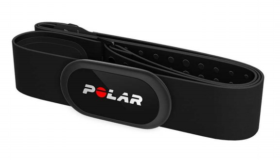
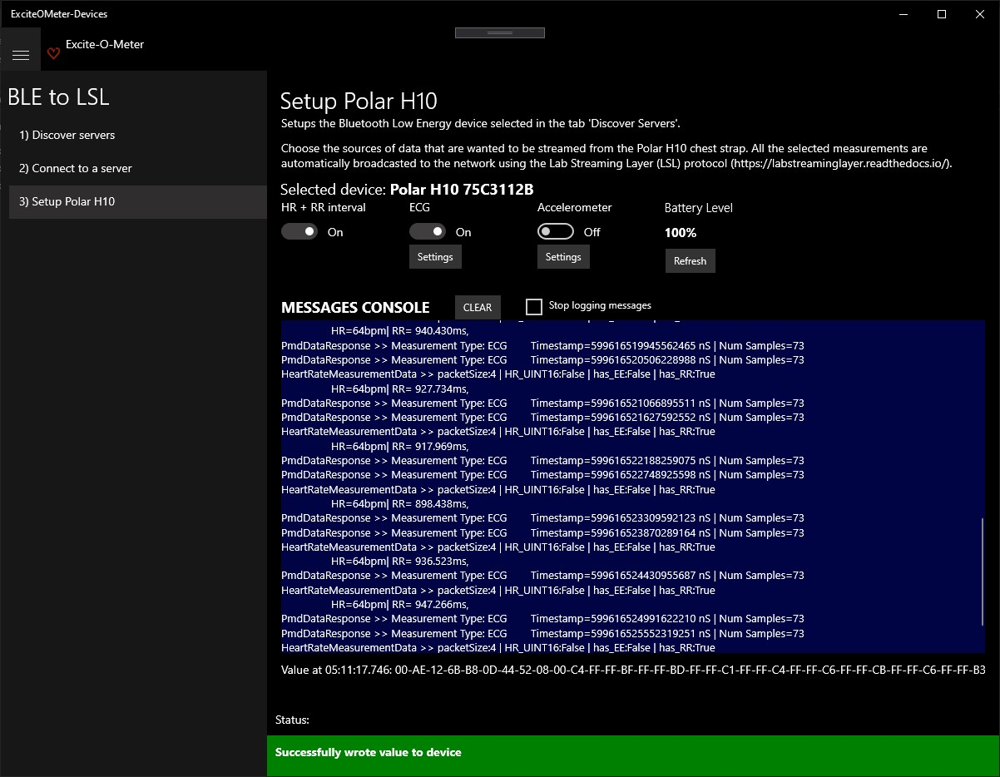
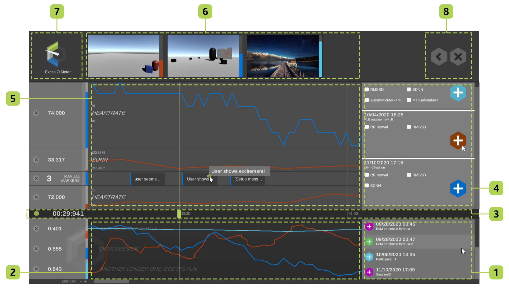

# Excite-O-Meter | README / User Manual >

 

Project Website: [http://exciteometer.eu/](http://exciteometer.eu/)

# Table of contents

0. [Quick Reference Guide] (#quick)
1. [Overall description](#intro)
2. [Excite-O-Meter Devices](#app1)
    1. [Version: Android](#app1a)
    1. [Version: Windows 10 UWP](#app1b)
3. [Excite-O-Meter Unity Plugin](#app2)
    1. [UI Online Recorder](#app2a)
    1. [UI Offline Analysis](#app2b)
4. [Scientific Disclaimer](#disclaimer)

---

# Quick Reference Guide <a name="quick"></a>

**Project Website:** [http://exciteometer.eu/](http://exciteometer.eu/)

The Excite-O-Meter is a software framework that allows developers to integrate physiological data in Extended Reality (XR) applications to calculate the level of 'excitement' that your application might be causing on participants. It is particularly suitable for researchers that conduct scientific experiments in XR with Unity but also for hobbists that are developing their own games and want to measure their own reaction to the game. The main **functionalities** that the Excite-O-Meter provides are:

- Scientifically validated set of metrics to estimate Excite-O-Meter level
- Easy integration of the tool by adding two prefabs to an existing Unity project.
- Instant access to real-time physiological data collection and offline data visualization module.
- Organize each participant in different sessions that are visualized in the Excite-O-Meter offline analysis tool, or get the CSV files with the data for your own data analysis.

### Excite-O-Meter Devices

Excite-O-Meter is compatible with Polar H10 chest strap ([link](https://www.polar.com/us-en/products/accessories/h10_heart_rate_sensor)). This module is the communication interface for the physiological sensor, collects data via Bluetooth and streams them to Unity. It is available for two platforms:

1. Option A: Download the `.apk` and install it on an Android phone.
1. OR option B: Download the `.zip` and install the Windows 10  application with Powershell, it needs to be a different computer than the one running the XR application.

### Unity Plugin

Include the Excite-O-Meter to your project to enable physiological analysis with just few clicks. Compatible with Unity 2019.4 or above.

1. Import the `UnityUIExtensions-2019.4.unitypackage` or download it from https://bitbucket.org/UnityUIExtensions/unity-ui-extensions/wiki/Downloads
1. Import the `ExciteOMeter.unitypackage` to your project.
1. Drag and drop both prefabs `ExciteOMeter_Manager` and `ExciteOMeter_UI_OnlineAnalysis` to the ROOT of your hierarchy.
1. Open your *Build Settings* and add the scene `ExciteOMeter_OfflineAnalysis` the panel *Scenes in Build*. This is the scene that allows to conduct data visualization.

### Build your application

Before building your application, delete the file `StreamingAsets/config.json` to generate a new configuration file the first time that the application is executed in the final build.
Every recorded session is inside the main folder named `LogFiles_ExciteOMeter`, found at the same level than your main `.exe` file.

---

# Description <a name="intro"></a>

## Functionalities

The Excite-O-Meter is a software framework that allows developers to integrate physiological data in Extended Reality (XR) applications to calculate the level of 'excitement' that your application might be causing on participants. It is particularly suitable for researchers that conduct scientific experiments in XR with Unity but also for hobbyists that are developing their own games and want to measure their own reaction to the game.

The main functionalities that the Excite-O-Meter provides to your XR application are:

- Scientifically validated set of metrics to estimate Excite-O-Meter level (* *See scientific disclaimer at the end of this document*)
- Easy integration of the tool by adding two prefabs to an existing Unity project.
- Instant access to real-time physiological data collection and offline data visualization module.
- Organize each participant in different sessions that are visualized in the Excite-O-Meter offline analysis tool, or get the CSV files with the data for your own data analysis.

## Basic Setup

Excite-O-Meter has been developed and tested to be compatible with the following cardiac sensor:

1. Polar H10 chest strap ([link](https://support.polar.com/e_manuals/H10_HR_sensor/Polar_H10_user_manual_English/manual.pdf ))



The whole system includes the use of two different types of applications

1. **Excite-O-Meter - Devices:** Communication interface for the physiological sensor, collects data via Bluetooth and streams them to Unity. It is available as an independent *Win10 UWP app* or an *apk* for Android.
2. **Excite-O-Meter - Unity Plugin:** .unitypackage that is included in your project to include physiological analysis with just few clicks.

# Excite-O-Meter Devices <a name="app1"></a>

## Wearing the Sensor <a name="sensor"></a>

First, you need to wear the Polar H10 chest strap:
- Moisten the electrode area of the strap
- Wear the chest strap
- Attach the connector to activate the HR sensor

## Collecting data

These set of applications are in charge of connecting to the physiological sensor via Bluetooth LE and send data to all applications running with the Excite-O-Meter plugin from Unity.

**Data from the sensor can be collected EITHER through Android mobile phone or a Windows 10 computer**. Some important notes about data communication are:

- The device that receives data from the sensor needs to be in the same local network (WiFi, LAN) than the device that runs your XR application in Unity.

- Due to a loopback restriction in Win10 UWP, in case you use *Excite-O-Meter Devices* on Win10 to collect data, **IT MUST BE A DIFFERENT PC** than the PC running your XR application, but still on the same LAN network.

- When creating a **built of your app in Unity** for Windows, it will prompt a Windows Security alert the first time you open your `.exe`. This message is shown because the Excite-O-Meter uses internally socket communication to send data between the sensor and Unity. If you do not approve this message, your application will not be able to receive data from the Excite-O-Meter. This issue can be fixed creating an explicit exception for incoming messages in Windows Firewall.

## Excite-O-Meter Devices | Android   <a name="app1a"></a>

The application is compatible with Android v6.0 or greater, API>=23.

### Installation

1. Send the .apk to the mobile phone either connecting it to the computer or direct download from the Excite-O-Meter [website](http://exciteometer.eu/).
1. Search in the **Settings** of the phone the option to allow unknown sources ([help](https://www.androidcentral.com/unknown-sources)) from either the file explorer or Google Chrome (depending the app used to download the APK).
1. If the pop-up with Google Play Protect appears, click on **Install anyway**. This prompt is likely to be shown because physiological data is sent through the network silently.
1. During execution, the app requires the following permissions: 

- *Turn on Localization* (same used for GPS, required by Android to pair with BLE devices). This  is **NOT explicitly requested by the application, but mandatory** to gather data from the sensor.
- *Access to location* (allow all the time to allow sending data even when the screen is off)
- *Turn on bluetooth* (to discover the sensor) It is necessary to have the Bluetooth ON, but **NOT** paired to the sensor, the app will automatically find the device when HR+RR or ECG signals are requested.

### Execution

The application looks like the image below. It allows to send either HR+RR data or ECG, but not both signals at the same time.


1. The first time that you open the app. You need to setup the Polar device's ID, which are the 8 letters located on top of the sensor. Every time you run the application, it will try to connect to the latest configured ID.
1. Click on **Connect HR/RR**, the application will connect through Bluetooth to the sensor and start collecting data. All the collected physiological values, are immediately forwarded to the network for Excite-O-Meter clients.

## Excite-O-Meter Devices | Windows 10 UWP <a name="app1b"></a>

Requires *Minimum Windows 10, version 1803 (10.0; Build 171734)*

### Installation
1. Extract the .zip file of the Excite-O-Meter-Devices for Win10 from the project's [website](http://exciteometer.eu/)
1. Right click the file `Add-AppDevPackage.ps1` and click on `Run with Powershell`. A new Powershell console will appear asking to proceed: Press `Y` to approve.

1. If the computer is not setup as developer or the certificate is not trusted, it will prompt a second Powershell console asking for permission to execute these steps, as shown next, press `Y` to accept. If these two conditions are met beforehand, then the installation of the package should start immediately.

1. Developer settings in Windows will open and you should choose `Developer mode` to allow the application install the respective certificate. Wait until Windows shows that the external packages have been installed. (*If concerned about security, once the application is installed, you can set back this feature to 'Microsoft Store or Sideloading', but any future update of the package will require to enable developer mode temporarily*)

1. Installation of the package should proceed as shown.

1. You find the application in the Windows Menu.


### Execution

- In the first screen, `Enumerate Devices` to see the available Bluetooth LE devices in advertising mode.
- If the device has never been connected to the app, press `Pair` and it will prompt connection with Windows.
- When the device is paired it will enable the option `Continue`. If a device starting with `Polar H10 ` is detected, it will jump to configure their characteristics. Otherwise, the second screen will be opened to explore their services and characteristics.
- Adjust the toggles according to the variables that want to collect from the sensor (HR+RRi, ECG, ACC). Note that ECG and ACC cannot be simultaneously enabled, the device stopped responding to requests when busy sending both streamings.



# Excite-O-Meter | Unity plugin  <a name="app2"></a>

The main plugin is found as a *.unitypackage* from the Excite-O-Meter [website](http://exciteometer.eu/)

**Requirements:**

- Developed and tested in Unity 2019.4
- Install *Unity UI Extensions* (tested with v2.2.2) official download from: [https://bitbucket.org/UnityUIExtensions/unity-ui-extensions/wiki/Downloads](https://bitbucket.org/UnityUIExtensions/unity-ui-extensions/wiki/Downloads)
- Install *TextMesh Pro* (tested with v2.0.1). If your project does not include it yet, Unity will show a prompt message as shown below when you drag and drop the prefab containing the UI of the Excite-O-Meter.


**Folder Structure:**

Once the package is imported in Unity, the Excite-O-Meter folder structure looks like the one below.

```
Assets
│   ...
│
└───ExciteOMeter
│   │
│   └───EoM
│   │   └─── ... // Internal EoM functionality
│   └───Prefabs
│   │   └─── EoM_BiofeedbackWorldSpace
│   │   └─── EoM_SignalEmulator
│   │   └─── ExciteOMeter_Manager
│   │   └─── ExciteOMeter_UI_OnlineAnalysis
│   └───Scenes
│   │   └─── ExciteOMeter_Demo
│   │   └─── ExciteOMeter_OfflineAnalysis
│   └─── EoM_UserManual.md
│   └─── EoM_UserManual.pdf
└─── ...
```

## Including Excite-O-Meter in your XR project from Unity Editor

1. Drag and drop both prefabs `ExciteOMeter_Manager` and `ExciteOMeter_UI_OnlineAnalysis` to the ROOT of your hierarchy. Root is needed because this objects are not destroyed between scene, in case your application runs over multiple scenes.
1. Open your *Build Settings* and add the scene `ExciteOMeter_OfflineAnalysis` the panel *Scenes in Build*. This is the scene that allows to conduct data visualization.

If you want to provide biofeedback, i.e. allow users to see the physiological signals inside the XR scene as a World Space Canvas, add the prefab `EoM_BiofeedbackWorldSpace` to your scene and it will automatically show the status connection and time series with the last 30 samples of data.

If you don't have access to the physiological sensor, but still want to test all the functionality of the Excite-O-Meter, you can drag and drop the prefab `EoM_SignalEmulator` to your hierarchy and it will simulate random data from the sensor.

### UI: Online Recorder <a name="app2a"></a>

The user interface of the online recorder looks like the image below. Each of the numbered components refer to:

1. *Open offline analysis:* Stops the current recording and opens the scene that allows offline data visualization (described in the next section).
1. *Incoming Signals:* Allows to visualize whether the physiological signals are received or not. Each signal has a color indicating connection status (green or red), the last received value and the plot of the signal.
1. *Signal problem warning:* It is displayed when a connection is dropped. If this message appears check your Android phone or Win10 app to guarantee that it is awake and sending data.
1. *Session information:* Allows to define a name of a session, define whether the session should take periodic screenshots of the scene, and a button to start or stop the session recording.
1. *Markers:* Allow the addition of contextual information that associates a timestamp with a specific event. Write a text in the input field to specify a message and click in the '+' button to add it. Quick markers are used to add markers with one click.
1. *Markers visualizer:* All the markers that are defined in the current session are displayed sequentially in this area. The markers will restart whenever the session is stopped.
1. *Biofeedback Panel:* Example of the GameObject that allows signal visualization inside the Unity scene.
1. *Scene:* Example Objects that compose your XR environment.


### UI: Offline Analysis <a name="app2b"></a>

The user interface of the offline analyzer looks like the image below. Each of the numbered components refer to:

1. *Session:* List of available sessions recorded in the disk. Each session corresponds to a folder inside the Excite-O-Meter logs folder (described below).
1. *Excite-O-Meter level:* Visualization of the Excite-O-Meter value calculated during the recorded session. The image shows one color per loaded session, up to three sessions could be loaded simultaneously.
1. *Timeline:* Dragging the green square horizontally shows the instantaneous values of the signal. If screenshots are available, it will update the image to the closest screenshot to the left of the timeline marker.
1. *Signals selection:* The right panel allows to choose specific signals to visualize from each session. It includes: Heart rate, R-R interval, RMSSD, SDNN and manual markers.
1. *Signals visualizer:* Area where the selected signals will be visualized on a stacked layout. You can delete a specific signal from the 'X' in the left side of the panel.
1. *Screenshot Visualizer*: If the session contains screenshots, a square with the closest screenshot to the timeline marker will be displayed, the right hand shows the Excite-O-Meter level for each of the sessions (coded by color).
1. *Average Excite-O-Meter level*: Shows the average of the Excite-O-Meter level at the timestamp specified in the timeline.
1. *Back to main app:* This button closes the offline analysis and returns to the scene from where it was called, i.e. the XR scene.




### Accessing Excite-O-Meter Logs

The recorded sessions are stored in the folder named `LogFiles_ExciteOMeter`. If the sessions are recorded from the *Unity Editor*, this folder is located at the same level than `Application.dataPath` (usually same level than `Assets`). In case the recordings are created after *Building* your application, this folder is located at the same level than your executable file (`.exe` on Windows).

Each folder contains a `.json` file used for offline data visualization and multiple `.csv` files with the raw data that was collected. These files can be used later for offline analysis in other platforms like Python, R, Excel, etc.

### Advanced configurations

1. **Screenshots:**
By default the Excite-O-Meter will take a screenshot of the scene every time that a marker is added. In addition, you can activate the checkbox that takes screenshots every 15 seconds periodically. Further personalization is done in the file `config.json` inside `StreamingAssets`.
1. **Adding custom events:**
If you want to execute your own scripts when a session starts or finishes from the online UI. You can place your events on the inspector of the GameObject `ExciteOMeter_Manager`. This is useful, for instance, when you want to trigger specific actions synchronized with data logging.
1. **Adding quick markers:** 
The quick markers are used to create custom markers on the timeline with one click. To add your own markers, you can look for the GameObject `QUICK_MARKERS_ExciteOMeter` in the hierarchy and duplicate the prefab `QuickMarker`. In the inspector of each quick marker, the component `QuickMarkerEoM` allows you to change the message and a custom event that will be executed when the specific marker is triggered.
1. **Changing data processing parameters:** 
The file `config.json` inside the `StreamingAssets` contains a key called `featureSettings` with basic configuration of the Excite-O-Meter that allows to change the parameters of the real-time processing workflow **even after building your application**.

- *isSampleBased: true/false* - Whether the feature is calculated when a number of samples are reached (true) or periodically every time (false)
- *windowTime: float* - For time-based: Time interval in seconds that will be used as buffer to calculate the feature.
- *overlapPercentageTime: float* - For time-based: Percentage of overlap between subsequent calculations (between 0.0 and 0.95)
- *sampleBufferLength: int* - For sample-based: Number of samples to reach before calculations.
- *overlapSamplesLength: int* - For sample-based: Number of samples to keep between subsequent calculations (integer lower than sampleBufferLength)
- *offsetSamplesInTimestamp: int* - For sample-based: Controls time-offset of the feature calculation. If 0, the feature calculation corresponds to the last collected timestamp. If 3, it will be assigned the timestamp of the sample  T-3.
- **EXAMPLES:** To calculate a time-based feature that updates the first time every 10 seconds, and every second afterwards, the first two values are `10, 0.9`; respectively. To calculate a sample-based feature of buffer 10, updated every new sample, and corresponding to a window `[t-6,t+3]`. The last three features will be `10, 9, 3`; respectively.


# Scientific Disclaimer <a name="disclaimer"></a>

The estimation of the Excite-O-Meter level shown by this application is a result of the first phase of scientific validation, which most likely will change in future development iterations. It does not represent an objective measure for medical or psychological trials.

- **Excite-O-Meter level:** The 'excitement' level was defined experimentally as follows: When data collection for a session has stopped, independently calculate perform a z-normalization of RRi and  RMSSD. Then, each value is converted into its corresponding percentile over the cumulative density function. Finally, the excitement level per timestamp is mapped as one minus average percentile of RRi and RMSSD.

The calculation of cardiac features is developed as defined on the folowing paper: *Shaffer F and Ginsberg JP (2017) An Overview of Heart Rate Variability Metrics and Norms. Front. Public Health 5:258. doi: 10.3389/fpubh.2017.00258* [view online](https://www.frontiersin.org/articles/10.3389/fpubh.2017.00258/full), and compared with the features calculated by the library Neurokit2 in Python.

- **RMSSD:** The root mean square of successive differences between normal heartbeats (RMSSD) is obtained by first calculating each successive time difference between heartbeats in ms. Then, each of the values is squared and the result is averaged before the square root of the total is obtained.
- **SDNN:** The standard deviation of the IBI of normal sinus beats (SDNN) is measured in ms. The related standard deviation of successive RR interval differences (SDSD) only represents short-term variability.


