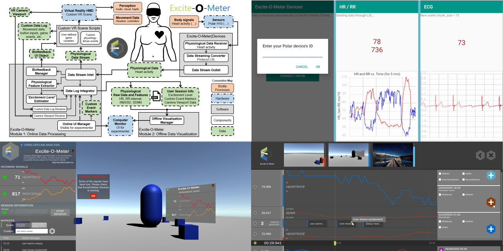

<a href="https://exciteometer.eu">

</a>

<!-- {:width="50%"} -->


*Quick links*

- [Description](#description)
- [How to use?](#how-to-use)
  - [Unity prerequisites](#unity-prerequisites)
  - [Measure bodily data from wearables](#measure-bodily-data-from-wearables)
  - [Importing package in Unity](#importing-package-in-unity)
  - [Example](#example)
  - [Cite the research paper](#cite-the-research-paper)
- [How to contribute?](#how-to-contribute)
- [More information](#more-information)
  - [Project's website](#projects-website)
  - [More research papers about the `Excite-O-Meter`](#more-research-papers-about-the-excite-o-meter)

---


# Description

The `Excite-O-Meter` (`EoM`) is a package that extends a standalone Unity project with functionalities to easily record users' data in experimental sessions. It captures heart and motion activity, automatically extracts relevant data features, and visualizes the data post data collection directly in your compiled desktop application. Suitable for Unity developers wanting to analyze body responses in users or researchers conducting empirical studies in XR.



---

The `EoM` enables the integation of heart activity and movement analysis in any standalone application created with Unity, intended for **Extended Reality (XR)**. This plugin contains all the logic to record data from external wearable sensors, log into persistent files, and visualize the captured data without leaving the Unity Editor. 

The tool is simple to use and doesn't require coding. The `EoM` is particularly suitable in two **use cases**: 1) for hobbyists or *Unity developers* wanting to measure the body responses that your application induces on your users. 2) for *researcher* running scientific experiments (e.g., psychology or behavioral research) in XR and wanting to easily collect data using a Unity environment that you created or found online.

The `EoM` may be used without external wearable sensors. However, the tool's main advantage is the easy integration with body sensors compatible with [LSL](https://github.com/sccn/labstreaminglayer). Currently, it is compatible with the chest strap sensor [Polar H10](https://www.polar.com/us-en/products/accessories/h10_heart_rate_sensor) to capture **heart rate (HR)** and heart rate variability data (HRV), *(see top-right image)*. It also records **movement** from any object in the scene, useful to record head movement from **Virtual Reality (VR)** headsets record headsets. Additionally, screenshots and manual string markers can be added to label specific events occurring while users interact with your XR environment. Finally, it includes a data visualizer to review the session of the user offline *(see bottom-right image)*, showing in synchrony all the time-series data, screenshots, and markers. Everything works in the Unity Editor and in the final **compiled** application.

# How to use?

**Note:** *The description below is a summary of the complete step-by-step [user manual available in this link](./docs/1_UserManual.md).*

The `EoM` includes two parts: 
1) The (`Excite-O-Meter|Devices`), a compiled software (versions for Android and Win10) that interfaces the physical sensor with Unity.
  - Download the Windows Application from the store: https://www.microsoft.com/store/apps/9NW9MSXHTQ5M
  - The code to compile the Android application that transforms Bluetooth stream into LSL is available in this repo: <https://github.com/luisqtr/exciteometer-devices-android/>
  - The code to compile the Windows UWP application that transforms Bluetooth stream into LSL is available in this repo: <https://github.com/luisqtr/exciteometer-devices-UWP/>
2) The `EoM` Unity package that integrates the functionalities in your custom standalone Unity project.
3) The script `EoM_DataReceiver.cs` can be attached to any existing scene to read the values from physiological data and custom markers and be processed as desired.

## Unity prerequisites

The `EoM` package already ships the library dependencies [LSL](https://github.com/sccn/labstreaminglayer) for collecting time series, and [UI Extensions](https://bitbucket.org/UnityUIExtensions/unity-ui-extensions/) to visualize time series as lines in the Unity UI. In addition, your Unity project requires the package [Text Mesh PRO](https://docs.unity3d.com/Packages/com.unity.textmeshpro@3.0/manual/index.html) (TMPro).

## Measure bodily data from wearables

Read about installation and setup in [this document](./docs/2_SetupDevices.md), the middleware software interfaces the Polar H10 sensor with Unity. 
The `Excite-O-Meter|Devices` can be downloaded from the [latest release branch](https://github.com/luisqtr/exciteometer/releases/latest). 

## Importing package in Unity

You can import the project in two ways depending on whether you use git or not. The simplest way is downloading the `.unitypackage` from the [latest release branch](https://github.com/luisqtr/exciteometer/releases/latest). 

If you prefer to clone the git in your own project, either to obtain the latest version or to [contribute](./CONTRIBUTING.md), you can use clone the `main` branch as a submodule: `git add submodule https://github.com/luisqtr/exciteometer.git`. Read more details in the [user manual](./docs/1_UserManual.md).

## Example

[A description of the example is available in this link](./docs/3_Example.md). The example scene `Scenes/Example_withURP_NewInputSystem.unity` shows the integration of the `EoM` in an existing Unity project.


## Cite the research paper

If the `EoM` is useful for your research, please consider citing the following paper:

> Quintero L, Muñoz JE, de Mooji J, Gaebler M. Excite-O-Meter: Software Framework to Integrate Heart Activity in Virtual Reality. In: *IEEE International Symposium on Mixed and Augmented Reality (ISMAR)*. Bari, Italy; 2021. p. 357–66. <https://doi.org/10.1109/ISMAR52148.2021.00052>

```tex
@inproceedings{Quintero2021_EoM,
    author = {Quintero, Luis and Mu{\~{n}}oz, John E and de Mooji, Jeroen and Gaebler, Michael},
    booktitle = {IEEE International Symposium on Mixed and Augmented Reality (ISMAR)},
    doi = {10.1109/ISMAR52148.2021.00052},
    pages = {357--366},
    title = {{Excite-O-Meter: Software Framework to Integrate Heart Activity in Virtual Reality}},
    year = {2021}
}
```

**Scientific disclaimer:** The `EoM` includes an algorithm that estimates *'excitement level'* from cardiac data. It MUST be considered considered on early stages and not as an objective scientifically validated measure. Please read the full disclaimer at the end of [this document](./docs/1_UserManual.md#).

# How to contribute?

Please read the guidelines about the [CODE OF CONDUCT](./CODE-OF-CONDUCT.md) and [CONTRIBUTION](./CONTRIBUTING.md).

# More information

## Project's website

The project's website (<http://exciteometer.eu/>) contains additional information. Although it gets updated less often than the GitHub repository (<https://github.com/luisqtr/exciteometer>).

## More research papers about the `Excite-O-Meter`

* The project is currently maintained by [Luis Quintero](https://luisqtr.com/), part of his PhD project at the [Data Science Group](http://datascience.dsv.su.se/) at Stockholm University, Sweden.
* The project leader was [Michael Gaebler](https://www.michaelgaebler.com/), who conceptualized the project and led the work from the first publication, as found in the branch [`release_v1.0.1`](https://github.com/luisqtr/exciteometer/tree/release_v1.0.1). [John Muñoz](http://johnhci.com/) and [Jeroen de Mooij](https://nl.linkedin.com/in/jeroendemooij) also heavily contributed in the conceptualization and UI development of the EoM, respectively.
* *Acknowledgements:*
* The authors wish to thank Anna Francová and Jessica Gärtner for their support in the empirical evaluation of the first version of the `EoM`; as well as Johanne Tromp, Felix Klotzsche, Mert Akbal, and Alexander Masurovsky for helping in the conceptualization of the project on its first stage.
* This project received funding from the European Union’s Horizon 2020 research and innovation programme through the XR4ALL project with grant agreement N° 825545.
* Thanks to all contributors from other libraries: [LSL](https://github.com/sccn/labstreaminglayer), [UI Extensions](https://bitbucket.org/UnityUIExtensions/unity-ui-extensions/).

