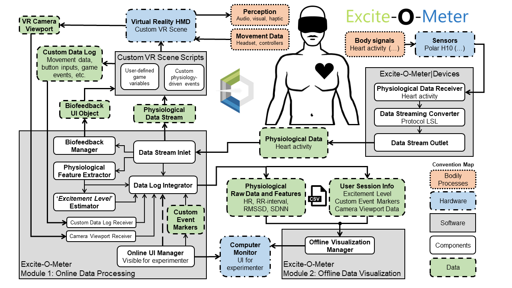

# **User Manual | Excite-O-Meter**

*Quick links*

- [**User Manual | Excite-O-Meter**](#user-manual--excite-o-meter)
- [Description](#description)
  - [Architecture](#architecture)
- [Configuration](#configuration)
  - [Dependencies](#dependencies)
  - [Setup external sensors with `Excite-O-Meter|Devices`](#setup-external-sensors-with-excite-o-meterdevices)
  - [Import the `EoM` Unity package](#import-the-eom-unity-package)
  - [Example scenario](#example-scenario)
- [Scientific disclaimer](#scientific-disclaimer)

---

# Description

The Excite-O-Meter `EoM` is a software framework that allows developers to integrate physiological data and movement analysis in any Extended Reality (XR) applications developed in Unity. The vision of the tool is to facilitate the data collection of bodily data that allows to automatically estimate the *'excitement level'* that an XR scenario induces on users. The main functionalities that the `EoM` gives to your XR application are:

- Easy integration (no code) with existing standalone Unity projects. A bit more than dragging and dropping few prefabs into an existing scene.
- Instant access to real-time physiological data collection, movement trajectories, and offline data visualization module.
- Data structure in folders ('sessions') that can be visualized with the integrated *offline data visualizer* or using the stored CSV files for your own post-hoc analysis.

## Architecture



The whole system includes the use of **two** different types of applications that can be downloaded from the [latest release branch](https://github.com/luisqtr/exciteometer/releases/latest):

1. **Excite-O-Meter|Devices:** is the communication interface for the physiological sensor, collects data via Bluetooth, and streams them to Unity. It is available as an independent *Win10 UWP app* or an *.apk* for Android.
2. **`EoM` Unity package** includes in your project all the described functionalities with just few clicks.

# Configuration

## Dependencies

Any Unity project using the `EoM` must also import separately the package [Text Mesh PRO](https://docs.unity3d.com/Packages/com.unity.textmeshpro@3.0/manual/index.html) (TMPro). If your project does not use TMPro yet, Unity will prompt a message when you drag and drop the `EoM` in your scene.

The `EoM` package **already contains** modified versions of two prerequired libraries (*no need to install them manually*):

1. [Lab Streaming Layer](https://github.com/sccn/labstreaminglayer): A great C# API that simplifies measurement of time series data through the network. Specifically, we modified the Unity version available from [LSL4Unity](https://github.com/xfleckx/LSL4Unity).
2. [UI Extensions v2.2.0](https://bitbucket.org/UnityUIExtensions/unity-ui-extensions/): This fantastic package makes possible easy time series visualization in the Unity UI.

## Setup external sensors with `Excite-O-Meter|Devices`

**The `EoM` can also be used without external sensors**, we included a prefab that simulates cardiac activity so that you can try the package without needing to setup additional software. However, the main advantage of the `EoM` is the simplicity to collect bodily data in Unity. Currently compatible with the chest strap sensor [Polar H10](https://www.polar.com/us-en/products/accessories/h10_heart_rate_sensor).

To use the external wearable, it is necessary to download the middleware software called `Excite-O-Meter | Devices`. It works as a bridge between the communication protocol from the device (e.g., Bluetooth Low Energy) and the LSL data captured in Unity.

The `Excite-O-Meter | Devices` is available for Windows or Android. 

> [Instructions available in this document](./2_SetupDevices.md) to capture heart activity data from the Polar H10 chest-strap into Unity.

## Import the `EoM` Unity package

There are two ways to include the `EoM` in your existing Unity project depending on whether your project already uses [GIT](https://git-scm.com/) or not. 

1) If you are already using Git as a version control system for your Unity project. Access your `Assets` directory from the terminal, and add the `EoM` as a submodule:
```bash
$ cd Assets/
$ git submodule add https://github.com/luisqtr/exciteometer.git
$ git submodule update --init
```
1) If your Unity project is not using Git, download the `.unitypackage` from the [latest release branch](https://github.com/luisqtr/exciteometer/releases/latest).

## Example scenario

The package also includes an example scene `Scenes/Example_withURP_NewInputSystem.unity`. The [description of the example](./3_Example.md) guides your through the use of each of the existing Unity prefabs, their functionality, and some minor customizations that you can do to adapt the `EoM` to your specific needs.

The last version of the example scene was tested on:
- Unity 2021.3.17
- Universal Rendering Pipeline - [URP v12.1.9](https://docs.unity3d.com/Packages/com.unity.render-pipelines.universal@10.6/manual/)
- Unity's New [Input System v1.0.2](https://docs.unity3d.com/Packages/com.unity.inputsystem@1.0/manual/index.html).
- OpenXR v1.6.0
- Project configured as standalone (Windows)

# Scientific disclaimer

The estimation of the Excite-O-Meter level shown by this application is a result of the first phase of validation, which most likely will change in future development iterations. It does not represent an objective measure for medical or psychological trials.

- **Excite-O-Meter level:** The 'excitement level' is an initial **estimation** and that was defined experimentally as follows: When data collection for a session has stopped, independently calculate perform a z-normalization of RRi and  RMSSD. Then, each value is converted into its corresponding percentile over the cumulative density function. Finally, the excitement level per timestamp is mapped as one minus average percentile of RRi and RMSSD.

The calculation of cardiac features is developed as defined on the folowing paper: *Shaffer F and Ginsberg JP (2017) An Overview of Heart Rate Variability Metrics and Norms. Front. Public Health 5:258. doi: 10.3389/fpubh.2017.00258* [view online](https://www.frontiersin.org/articles/10.3389/fpubh.2017.00258/full), and compared with the features calculated by the library Neurokit2 in Python.

- **RMSSD:** The root mean square of successive differences between normal heartbeats (RMSSD) is obtained by first calculating each successive time difference between heartbeats in ms. Then, each of the values is squared and the result is averaged before the square root of the total is obtained.
- **SDNN:** The standard deviation of the IBI of normal sinus beats (SDNN) is measured in ms. The related standard deviation of successive RR interval differences (SDSD) only represents short-term variability.