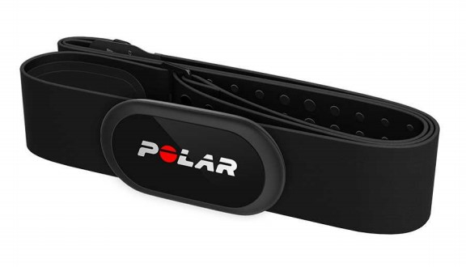
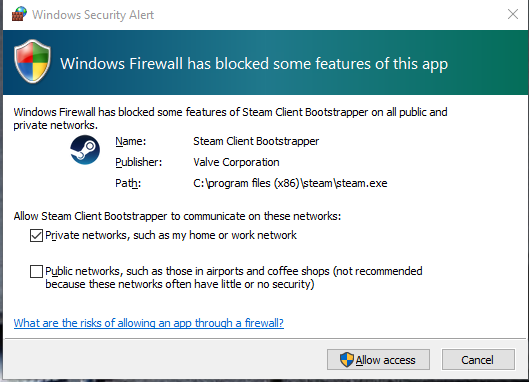
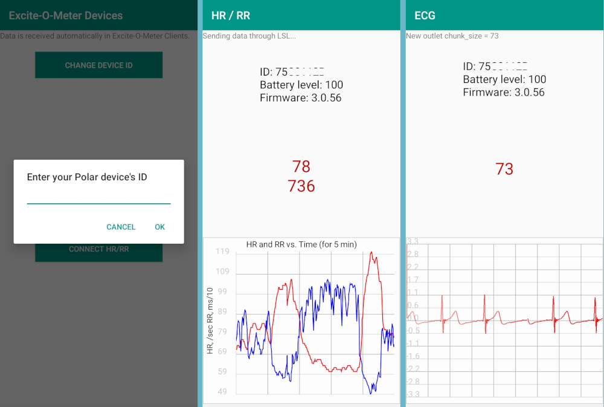
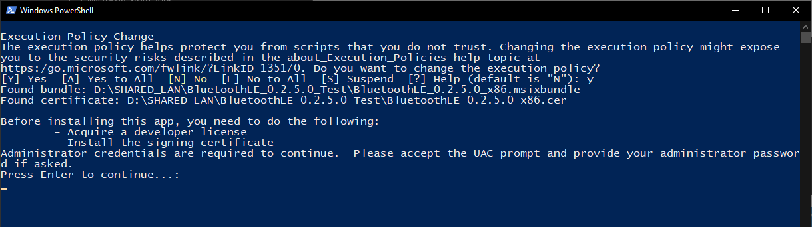
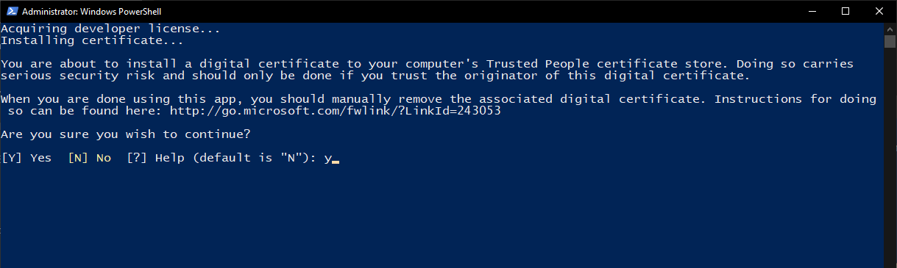
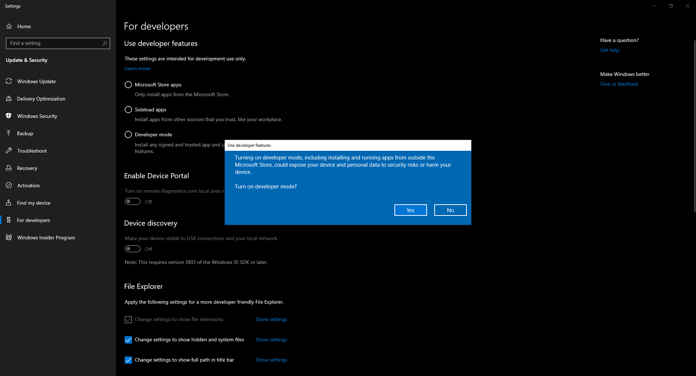
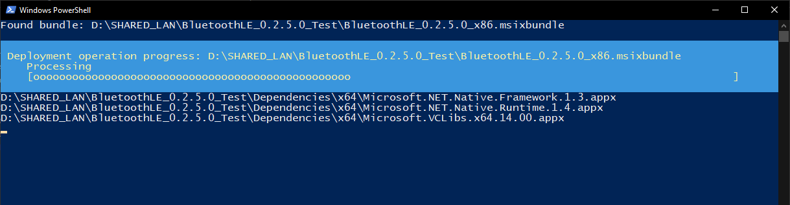
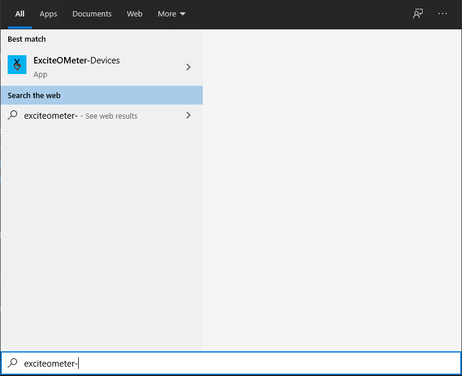
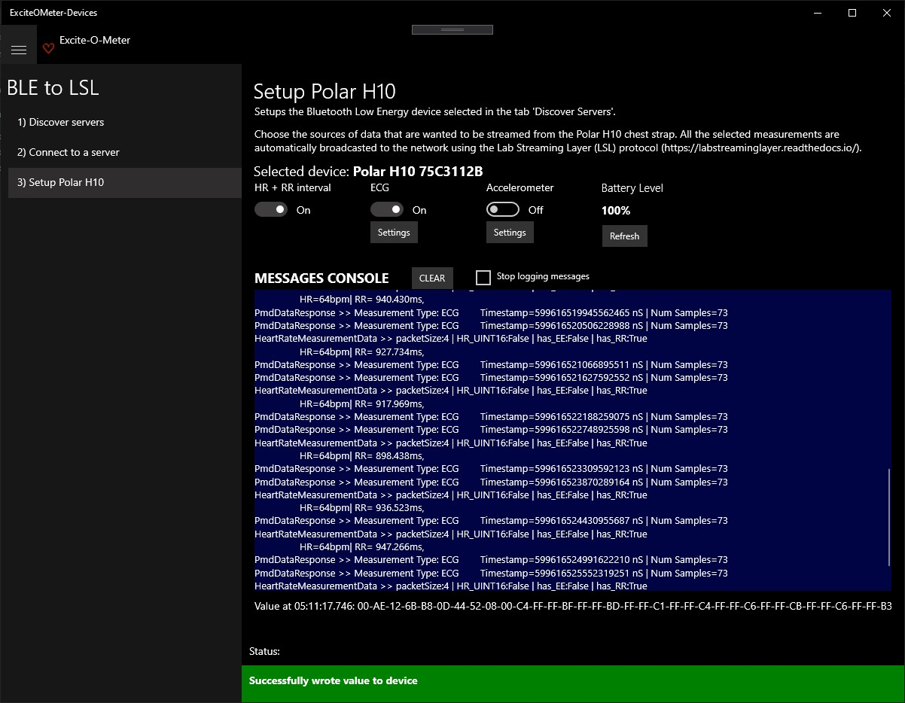

# **Setup `Excite-O-Meter|Devices`**

*Quick links*

- [**Setup `Excite-O-Meter|Devices`**](#setup-excite-o-meterdevices)
- [About `Excite-O-Meter|Devices`](#about-excite-o-meterdevices)
  - [Wearing the Sensor](#wearing-the-sensor)
  - [Collecting data](#collecting-data)
- [Excite-O-Meter|Devices \> for Android](#excite-o-meterdevices--for-android)
  - [Installation](#installation)
  - [Execution](#execution)
- [Excite-O-Meter|Devices \> for Windows 10 UWP](#excite-o-meterdevices--for-windows-10-uwp)
  - [Installation](#installation-1)
  - [Execution](#execution-1)
- [Continue with installation in Unity](#continue-with-installation-in-unity)

# About `Excite-O-Meter|Devices`

The `Excite-O-Meter|Devices` configures the communication interface for the physiological sensor, collects data via Bluetooth, and streams them to the Unity Editor via [LSL](https://github.com/sccn/labstreaminglayer). It is available as an **.apk file for Android** or a Universal Windows Platform **UWP for Windows 10**. 

The primary purpose is to transform the data captured from devices that are not natively compatible with LSL into valid LSL outlets that can be captured in Unity. This middleware might not be needed if there are sensors that are already [compatible with LSL](https://labstreaminglayer.readthedocs.io/info/supported_devices.html). 

The tool is currently supporting the following sensor:

<!--  -->

||device|function|
|---|---|---|
|| Chest strap [Polar H10 ](https://support.polar.com/e_manuals/H10_HR_sensor/Polar_H10_user_manual_English/manual.pdf) | Translate HR and RR-intervals from Bluetooth LE to LSL|
| | |

## Wearing the Sensor

First, you need to wear the chest strap Polar H10:
- Moisten the electrode area of the strap
- Wear the chest strap
- Attach the connector to activate the HR sensor

## Collecting data

These set of applications are in charge of connecting to the physiological sensor via Bluetooth LE and send data to all applications running with the Excite-O-Meter package from Unity.

**You need to use _EITHER_ the Android mobile phone or a Windows 10 computer**.

Some important notes about communication between `Excite-O-Meter|Devices` and Unity are:

- The device that runs `Excite-O-Meter|Devices` to receive data from the sensor **must** be in the same local network (WiFi, LAN) than the device that runs your XR application in Unity. Regardless if you run the Android or Win10 version.
- Use the **Android APK** if you already have easy access to an Android phone configured in developer mode. Beware that the you need keep the mobile screen awake (e.g., touching the screen) while the data collection is happening (*for this reason we recommend running Win10 UWP*).
- To use the **Win10 UWP**, the `Excite-O-Meter|Devices` has a [loopback restriction in UWP apps](https://stackoverflow.com/questions/33259763/uwp-enable-local-network-loopback) that complicates data streaming on the same PC. You can use the [PowerShell script described here](https://github.com/luisqtr/exciteometer-devices-UWP#creating-an-exception-for-the-loopback-restriction) to create an exemption and allow streaming and receiving LSL data from the same device.
- When **building your app in Unity** as standalone. The first time you run the `.exe`, it will likely prompt a Windows Security alert (*as in the image below*) requesting access to the network. **You must approve allow access**. Since the `Excite-O-Meter|Devices` internally uses socket communication to send data between the sensor and Unity, it needs access to the network. If you do not approve this message, your application will not be able to receive data in your Unity application. This issue can be fixed creating an explicit exception for incoming messages in the *Windows Defender Firewall*.

# Excite-O-Meter|Devices > for Android

The application is compatible with Android v6.0 or greater, API>=23.

## Installation

1. Send the `.apk` to the mobile phone either connecting it to the computer or direct download from the [latest release branch](https://github.com/luisqtr/exciteometer/releases/latest) or the project's [website](http://exciteometer.eu/).
2. Search in the **Settings** of the phone the option to allow unknown sources ([help](https://www.androidcentral.com/unknown-sources)) from either the file explorer or Google Chrome (depending the app used to download the APK).
3. If the pop-up with Google Play Protect appears, click on **Install anyway**. This prompt is likely to be shown because physiological data is sent through the network silently.
4. During execution, the app requires the following permissions: 

- *Turn on Localization* (same used for GPS, required by Android to pair with BLE devices). This  is **NOT explicitly requested by the application, but mandatory** to gather data from the sensor.
- *Access to location* (allow all the time to allow sending data even when the screen is off)
- *Turn on bluetooth* (to discover the sensor) It is necessary to have the Bluetooth ON, but **NOT** paired to the sensor, the app will automatically find the device when HR+RR or ECG signals are requested.

## Execution

The application looks like the image below. It allows to send either HR+RR data or ECG, but not both signals at the same time.

1. The first time that you open the app. You need to setup the Polar device's ID, which are the 8 letters located on top of the sensor. Every time you run the application, it will try to connect to the latest configured ID.
1. Click on **Connect HR/RR**, the application will connect through Bluetooth to the sensor and start collecting data. All the collected physiological values, are immediately forwarded to the network for Excite-O-Meter clients.

# Excite-O-Meter|Devices > for Windows 10 UWP

Requires *Minimum Windows 10, version 1803 (10.0; Build 171734)* 

Download from Windows Store: https://www.microsoft.com/store/apps/9PFMNFQJB99Q

Otherwise follow the steps below to install the application manually.

## Installation

1. Extract the .zip file of the Excite-O-Meter-Devices for Win10 from the [latest release branch](https://github.com/luisqtr/exciteometer/releases/latest)

2. Right click the file `Add-AppDevPackage.ps1` and click on `Run with Powershell`. A new Powershell console will appear asking to proceed: Press `Y` to approve.

3. If the computer is not setup as developer or the certificate is not trusted, it will prompt a second Powershell console asking for permission to execute these steps, as shown next, press `Y` to accept. If these two conditions are met beforehand, then the installation of the package should start immediately. 
**NOTE:** *This step also verifies that the Windows developer's certificate is still valid. The certificate expires 1-year after compilation. If there are problems with this certificate when installing, please post an issue on GitHub and we will generate an new build with the updated certificate. Read more info in [issue #3](https://github.com/luisqtr/exciteometer/issues/3)*.

4. Developer settings in Windows will open and you should choose `Developer mode` to allow the application install the respective certificate. Wait until Windows shows that the external packages have been installed. (*If concerned about security, once the application is installed, you can set back this feature to 'Microsoft Store or Sideloading', but any future update of the package will require to enable developer mode temporarily*)

5. Installation of the package should proceed as shown.

6. You find the application in the Windows Menu.

## Execution

- In the first screen, `Enumerate Devices` to see the available Bluetooth LE devices in advertising mode.
- If the device has never been connected to the app, press `Pair` and it will prompt connection with Windows.
- When the device is paired it will enable the option `Continue`. If a device starting with `Polar H10 ` is detected, it will jump to configure their characteristics. Otherwise, the second screen will be opened to explore their services and characteristics.
- Adjust the toggles according to the variables that want to collect from the sensor (HR+RRi, ECG, ACC). Note that ECG and ACC cannot be simultaneously enabled, the device stopped responding to requests when busy sending both streamings.

# Continue with installation in Unity

After this step, you can continue setting up the package in Unity, as described in the [user manual documentation](./1_UserManual.md)