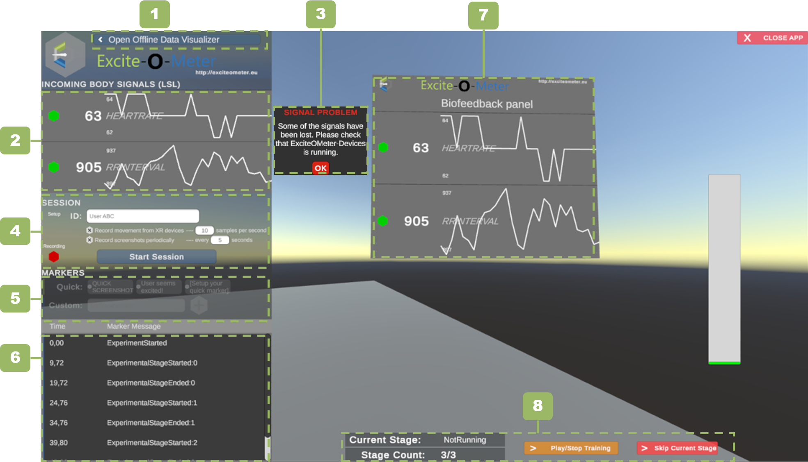

# **Example Unity | Excite-O-Meter**

*Quick links*

- [**Example Unity | Excite-O-Meter**](#example-unity--excite-o-meter)
  - [- Advanced configurations](#--advanced-configurations)
- [Setup a compatible Unity project](#setup-a-compatible-unity-project)
  - [Requirements](#requirements)
  - [Folder Structure](#folder-structure)
- [Including the Excite-O-Meter](#including-the-excite-o-meter)
  - [UI: Online Recorder](#ui-online-recorder)
  - [UI: Offline Analysis](#ui-offline-analysis)
  - [Accessing Excite-O-Meter Logs](#accessing-excite-o-meter-logs)
  - [Build your application](#build-your-application)
  - [Advanced configurations](#advanced-configurations)
---

# Setup a compatible Unity project

## Requirements

The example requires that you

- Developed and tested in Unity 2020.3.19f1
- Install *TextMesh Pro* (tested with v2.0.1). If your project does not include it yet, Unity will show a prompt message as shown below when you drag and drop the prefab containing the UI of the Excite-O-Meter.
    


## Folder Structure

Once the package is imported in Unity, the Excite-O-Meter folder structure looks like the one below.

```
Assets
│   ...
│
└───ExciteOMeter
│   │
│   └───EoM
│   │   └─── ... // Internal EoM functionality
│   └───Prefabs
│   │   └─── EoM_BiofeedbackWorldSpace
│   │   └─── EoM_SignalEmulator
│   │   └─── ExciteOMeter_Manager
│   │   └─── ExciteOMeter_UI_OnlineAnalysis
│   └───Scenes
│   │   └─── ExciteOMeter_Demo
│   │   └─── ExciteOMeter_OfflineAnalysis
│   └─── EoM_UserManual.md
│   └─── EoM_UserManual.pdf
└─── ...
```

# Including the Excite-O-Meter

1. Drag and drop both prefabs `ExciteOMeter_Manager` and `ExciteOMeter_UI_OnlineAnalysis` to the ROOT of your hierarchy. Root is needed because this objects are not destroyed between scene, in case your application runs over multiple scenes.
1. Open your *Build Settings* and add the scene `ExciteOMeter_OfflineAnalysis` the panel *Scenes in Build*. This is the scene that allows to conduct data visualization.

If you want to provide biofeedback, i.e. allow users to see the physiological signals 
inside the XR scene as a World Space Canvas, add the prefab `EoM_BiofeedbackWorldSpace` to your scene and it will automatically show the status connection and time series with the last 30 samples of data.

If you don't have access to the physiological sensor, but still want to test all the functionality of the Excite-O-Meter, you can drag and drop the prefab `EoM_SignalEmulator` to your hierarchy and it will simulate random data from the sensor.

## UI: Online Recorder

The user interface of the online recorder looks like the image below. Each of the numbered components refer to:

1. *Open offline analysis:* Stops the current recording and opens the scene that allows offline data visualization (described in the next section).
1. *Incoming Signals:* Allows to visualize whether the physiological signals are received or not. Each signal has a color indicating connection status (green or red), the last received value and the plot of the signal.
1. *Signal problem warning:* It is displayed when a connection is dropped. If this message appears check your Android phone or Win10 app to guarantee that it is awake and sending data.
1. *Session information:* Allows to define a name of a session, define whether the session should take periodic screenshots of the scene, and a button to start or stop the session recording.
1. *Markers:* Allow the addition of contextual information that associates a timestamp with a specific event. Write a text in the input field to specify a message and click in the '+' button to add it. Quick markers are used to add markers with one click.
1. *Markers visualizer:* All the markers that are defined in the current session are displayed sequentially in this area. The markers will restart whenever the session is stopped.
1. *Biofeedback Panel:* Example of the GameObject that allows signal visualization inside the Unity scene.
1. *Scene:* Example Objects that compose your XR environment.



## UI: Offline Analysis

The user interface of the offline analyzer looks like the image below. Each of the numbered components refer to:

1. *Session:* List of available sessions recorded in the disk. Each session corresponds to a folder inside the Excite-O-Meter logs folder (described below).
1. *Excite-O-Meter level:* Visualization of the Excite-O-Meter value calculated during the recorded session. The image shows one color per loaded session, up to three sessions could be loaded simultaneously.
1. *Timeline:* Dragging the green square horizontally shows the instantaneous values of the signal. If screenshots are available, it will update the image to the closest screenshot to the left of the timeline marker.
1. *Signals selection:* The right panel allows to choose specific signals to visualize from each session. It includes: Heart rate, R-R interval, RMSSD, SDNN and manual markers.
1. *Signals visualizer:* Area where the selected signals will be visualized on a stacked layout. You can delete a specific signal from the 'X' in the left side of the panel.
1. *Screenshot Visualizer*: If the session contains screenshots, a square with the closest screenshot to the timeline marker will be displayed, the right hand shows the Excite-O-Meter level for each of the sessions (coded by color).
1. *Average Excite-O-Meter level*: Shows the average of the Excite-O-Meter level at the timestamp specified in the timeline.
1. *Back to main app:* This button closes the offline analysis and returns to the scene from where it was called, i.e. the XR scene.


## Accessing Excite-O-Meter Logs

The recorded sessions are stored in the folder named `LogFiles_ExciteOMeter`. If the sessions are recorded from the *Unity Editor*, this folder is located at the same level than `Application.dataPath` (usually same level than `Assets`). In case the recordings are created after *Building* your application, this folder is located at the same level than your executable file (`.exe` on Windows).

Each folder contains a `.json` file used for offline data visualization and multiple `.csv` files with the raw data that was collected. These files can be used later for offline analysis in other platforms like Python, R, Excel, etc.


## Build your application

Before building your application, delete the file `StreamingAsets/config.json` to generate a new configuration file the first time that the application is executed in the final build.
Every recorded session is inside the main folder named `LogFiles_ExciteOMeter`, found at the same level than your main `.exe` file.

## Advanced configurations

1. **Screenshots:**
By default the Excite-O-Meter will take a screenshot of the scene every time that a marker is added. In addition, you can activate the checkbox that takes screenshots every 15 seconds periodically. Further personalization is done in the file `config.json` inside `StreamingAssets`.
1. **Adding custom events:**
If you want to execute your own scripts when a session starts or finishes from the online UI. You can place your events on the inspector of the GameObject `ExciteOMeter_Manager`. This is useful, for instance, when you want to trigger specific actions synchronized with data logging.
1. **Adding quick markers:** 
The quick markers are used to create custom markers on the timeline with one click. To add your own markers, you can look for the GameObject `QUICK_MARKERS_ExciteOMeter` in the hierarchy and duplicate the prefab `QuickMarker`. In the inspector of each quick marker, the component `QuickMarkerEoM` allows you to change the message and a custom event that will be executed when the specific marker is triggered.
1. **Changing data processing parameters:** 
The file `config.json` inside the `StreamingAssets` contains a key called `featureSettings` with basic configuration of the Excite-O-Meter that allows to change the parameters of the real-time processing workflow **even after building your application**.

- *isSampleBased: true/false* - Whether the feature is calculated when a number of samples are reached (true) or periodically every time (false)
- *windowTime: float* - For time-based: Time interval in seconds that will be used as buffer to calculate the feature.
- *overlapPercentageTime: float* - For time-based: Percentage of overlap between subsequent calculations (between 0.0 and 0.95)
- *sampleBufferLength: int* - For sample-based: Number of samples to reach before calculations.
- *overlapSamplesLength: int* - For sample-based: Number of samples to keep between subsequent calculations (integer lower than sampleBufferLength)
- *offsetSamplesInTimestamp: int* - For sample-based: Controls time-offset of the feature calculation. If 0, the feature calculation corresponds to the last collected timestamp. If 3, it will be assigned the timestamp of the sample  T-3.
  - **EXAMPLES:** To calculate a time-based feature that updates the first time every 10 seconds, and every second afterwards, the first two values are `10, 0.9`; respectively. To calculate a sample-based feature of buffer 10, updated every new sample, and corresponding to a window `[t-6,t+3]`. The last three features will be `10, 9, 3`; respectively.
